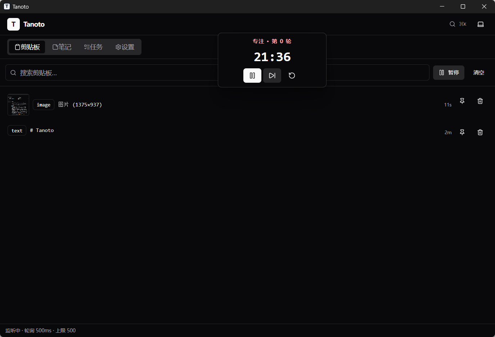
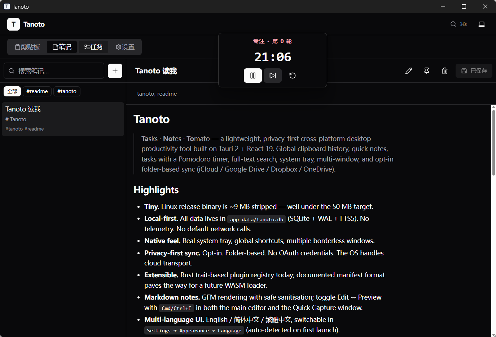
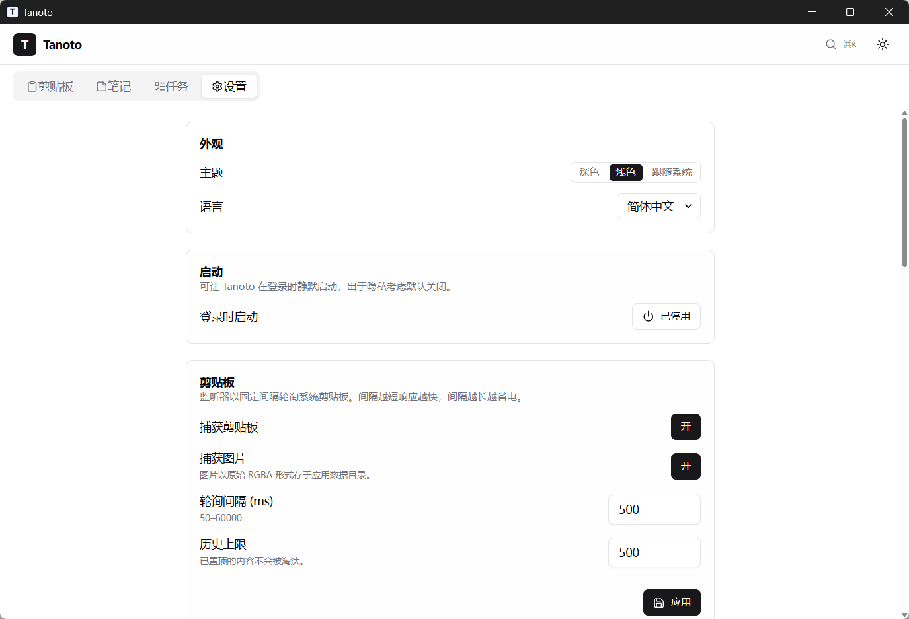

# tanoto-releases

>	Tanoto - A lightweight, privacy-first cross-platform desktop productivity tool.

## Change Log

### v1.0.0 release (2026-05-15)

- first version released

### v1.0.1 release (2026-05-16)

- fix(notes): adapt markdown code blocks to light and dark themes

### v1.0.2 release (2026-05-22)

- security: guard markdown external links

## Screenshorts

